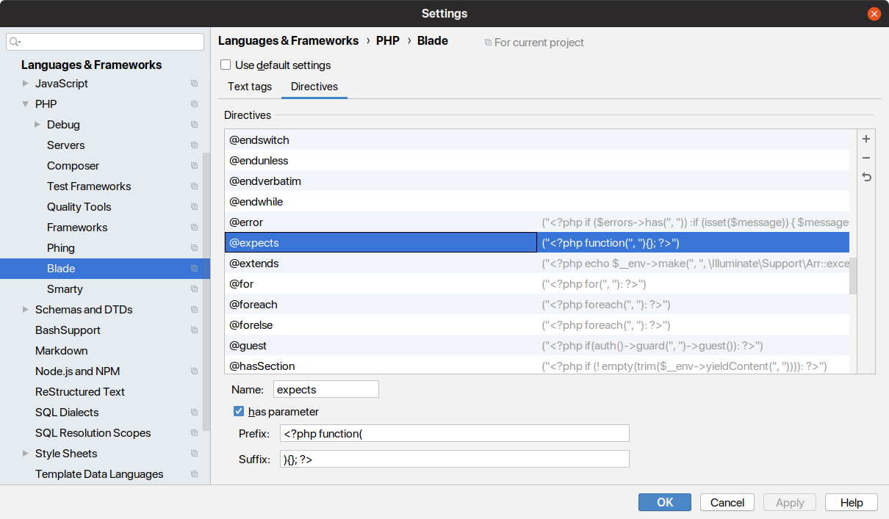

[](https://github.com/vaites/laravel-blade-expects/releases/latest)
[](https://packagist.org/packages/vaites/laravel-blade-expects)
[](https://github.com/vaites/laravel-blade-expects/blob/master/LICENSE)

# Laravel Blade @expects

**IMPORTANT**: this package is in its early stages and is not widely tested against all supported versions of PHP.
Please, use with caution...

## Motivation

[Blade templates](https://laravel.com/docs/5.8/blade) are great, but lacks a good way to define the variables it 
requires to work. In a normal template you must check if variables are set and/or set a default value for it. 

Take this example:

```blade
<?php

if(!isset($type))
{
    $type = 'boxed';
}

?>
<div class="component component-{{ $type }}">
    @if($type == 'big')
        <h1 class="component-title">{{ $object->title }}</h1>
    @endif
    
    <div class="component-content component-content-{{ $size ?? 'medium' }}">
        {{ $object->content }}
    </h1>
</div>
``` 

You must check if some variables are defined and set default values for some others. A colleague who has not worked with 
this template might ask:

* Which variables must be defined for the template to work??
* What are the default values for undefined variables?
* Which class must be the `$object` instance?
* What happens if `$object` is not an instance of the right class?

In big templates with lots of complex HTML code mixed with CSS framework classes and JS framework attributes, guessing 
this information can be quite difficult. To solve these problems, this package adds a simple `@expects` directive to 
define the variables expected by the view:

```blade
@expects(\App\Object $object, string $type, string $size = 'medium')
<div class="component component-{{ $type }}">
    @if($type == 'big')
        <h1 class="component-title">{{ $object->title }}</h1>
    @endif
    
    <div class="component-content component-content-{{ $size' }}">
        {{ $object->content }}
    </h1>
</div>
```

This will force `$object` to be defined as a `\App\Object` instance, `$type` as a string and `$size` will take the
 *medium* value if not set. 

**The goal is that any programmer who works with the template knows immediately which variables are necessary for 
its operation, its types and default values.**

## How it works

The directive is parsed like a closure to extract its parameters. The definition tells what to do:

* If the parameter has no default value, the variable is required and an exception is thrown
* If the parameter has a default value, this value is set if not defined
* The [type declaration](https://www.php.net/manual/en/functions.arguments.php#functions.arguments.type-declaration)
sets the required type and and exception is thrown if not matches (optional)

This is translated in simple PHP conditionals placed in the compiled template. 

Exceptions thrown are:

* `\Vaites\Laravel\BladeExpects\BladeExpectsUndefinedVariableException`
* `\Vaites\Laravel\BladeExpects\BladeExpectsWrongTypeException`
* `\Vaites\Laravel\BladeExpects\BladeExpectsWrokgClassException`

All variables inherit from `\Vaites\Laravel\BladeExpects\BladeExpectsException` that inherits from 
`InvalidArgumentException`.

## Installation

Just install using `composer` and Laravel will load it automagically:

```bash
composer require vaites/laravel-blade-expects
```

If you don't want to use the [package auto-discovery](https://medium.com/@taylorotwell/package-auto-discovery-in-laravel-5-5-ea9e3ab20518)
you will need to add this to the service providers in `config/app.php`:

```php
'providers' => [
    // ...
    \Vaites\Laravel\BladeExpects\BladeExpectsServiceProvider::class,
]
```

## Requirements

The only requirement is Laravel 5.5 or greater. The recommended version of PHP is 7.1 or greater but any version
supported by Laravel will work.

## PhpStorm integration

The PhpStorm IDE can recognize the custom Blade directive if is set in *File > Settings > Languages & Frameworks > PHP >
Blade > Directives* by adding a new one with the following properties:

 * Name: expects
 * Has parameters: check
 * Prefix: <?php function(
 * Suffix: ){}; ?>

